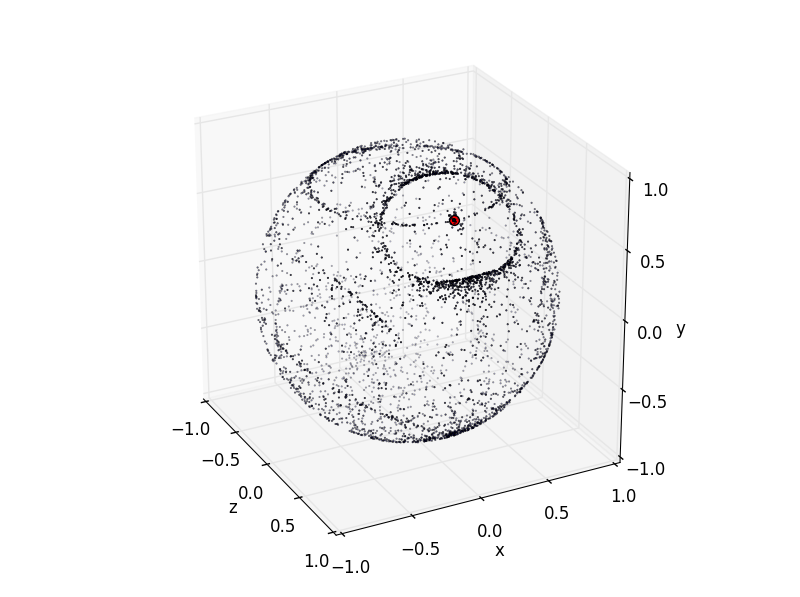

Ice Crystal Halo Simulator
==========================

Single-threaded CPU-implementation of a halo simulator designed to visualize different halo phenomena resulting from sunlight hitting hexagonal ice crystals in the atmosphere.
This is just a crude prototype to facilitate developing a more polished and parallelized simulator later on.

**Update:** The more polished and parallelized simulator is now available: https://github.com/naavis/haloray

Dependencies
------------
The simulator is written in Python and depends on the following
libraries:

- Numpy
- Matplotlib
